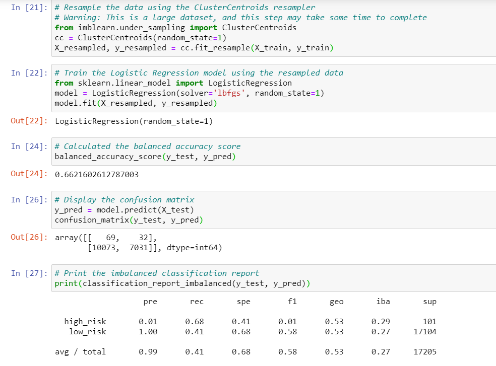

# Credit_Risk_Analysis

## Project Overview

The task of this project is to employ different techniques to train and evaluate models with unbalanced classes using the imbalanced-learn and scihit-learn libraries to build and evaluate models using resampling. The credit card dataset is from LendingClub, a peer-to-peer lending services company.

The tasks for this project are to predict credit risk using:

1. The Resampling Models
2. The SMOTEEN Algorithm
3. Ensemble Classifiers

Files:

1. credit_risk_resampling.ipynb
2. credit_risk_ensemble.ipynb
3. LoanStats_2019Q1

## Analysis & Results

- 6 machine learning models
- 3 scores
  1. Balanced Accuracy
  2. Precision
  3. Recall
- 3 measures for analysis
  1. Accuracy Score
  2. Confusion Matrix
  3. Imbalanced Classification Report

**RESAMPLING:**

1. Naive Random Oversampling

2. SMOTE Oversampling

3. Cluster Centroid Undersampling

4. SMOTEENN Combo Sampling (Over and Under)

**ENSEMBLE:**

1. Balanced Random Forest Classifier

2. Easy Ensemble AdaBoost Classifier

## Summary